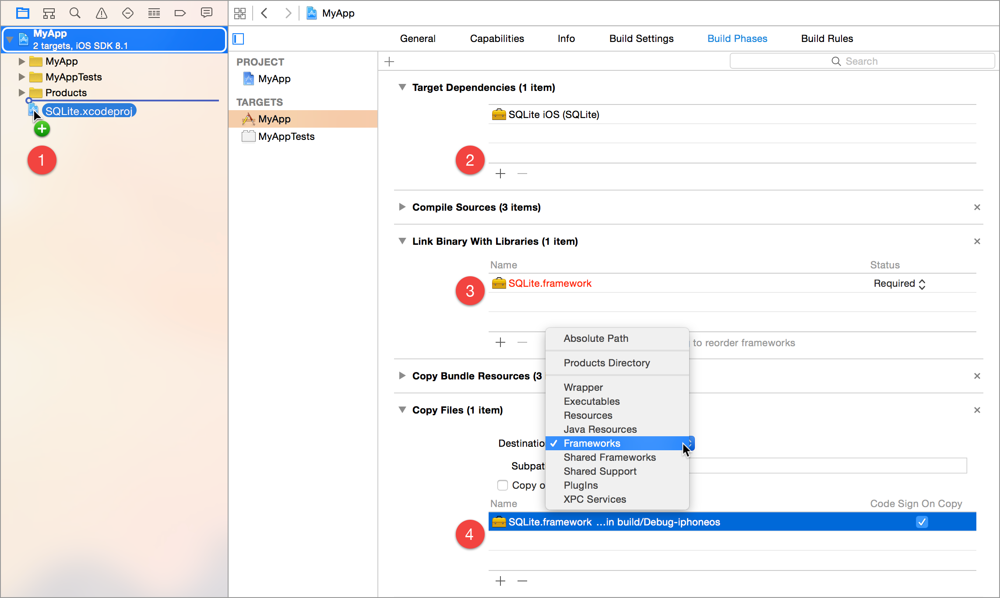

# SQLite.swift

A pure [Swift][1.1] framework wrapping [SQLite3][1.2].

[SQLite.swift][1.3] aims to be small, simple, and safe.

[1.1]: https://developer.apple.com/swift/
[1.2]: http://www.sqlite.org
[1.3]: https://github.com/stephencelis/SQLite.swift


## Features

 - A lightweight, uncomplicated query and parameter binding interface
 - A flexible, chainable, type-safe query builder
 - Safe, automatically-typed data access
 - Transactions with implicit commit/rollback
 - Developer-friendly error handling and debugging
 - Well-documented
 - Extensively tested


## Usage

Explore interactively from the Xcode project’s playground.


``` swift
import SQLite

let db = Database("path/to/db.sqlite3")

db.execute(
    "CREATE TABLE users (" +
        "id INTEGER PRIMARY KEY, " +
        "email TEXT NOT NULL UNIQUE, " +
        "manager_id INTEGER, " +
        "FOREIGN KEY(manager_id) REFERENCES users(id)" +
    ")"
)

let stmt = db.prepare("INSERT INTO users (email) VALUES (?)")
for email in ["alice@example.com", "betsy@example.com"] {
    stmt.run(email)
}

db.totalChanges // 2
db.lastChanges  // {Some 1}
db.lastID       // {Some 2}

for row in db.prepare("SELECT id, email FROM users") {
    println("id: \(row[0]), email: \(row[1])")
    // id: Optional(1), email: Optional("betsy@example.com")
    // id: Optional(2), email: Optional("alice@example.com")
}

db.scalar("SELECT count(*) FROM users") // {Some 2}

let jr = db.prepare("INSERT INTO users (email, manager_id) VALUES (?, ?)")
db.transaction(
    stmt.run("dolly@example.com"),
    jr.run("emery@example.com", db.lastID)
)
```

SQLite.swift also exposes a powerful, type-safe query building interface.

``` swift
let users = db["users"]
let email = Expression<String>("email")
let admin = Expression<Bool>("admin")
let age = Expression<Int>("age")

for user in users.filter(admin && age >= 30).order(age.desc) { /* ... */ }
// SELECT * FROM users WHERE (admin) AND (age >= 30) ORDER BY age DESC

for user in users.group(age, having: count(age) == 1) { /* ... */ }
// SELECT * FROM users GROUP BY age HAVING count(age) = 1

users.count
// SELECT count(*) FROM users

users.filter(admin).average(age)
// SELECT average(age) FROM users WHERE admin

if let id = users.insert(email <- "fiona@example.com") { /* ... */ }
// INSERT INTO users (email) VALUES ('fiona@example.com')

let ageless = users.filter(admin && age == nil)
let updates: Int = ageless.update(admin <- false)
// UPDATE users SET admin = 0 WHERE (admin) AND (age IS NULL)
```


## Installation

_Note: SQLite.swift requires Swift 1.1 (available in [Xcode 6.1][4.1])._

To install SQLite.swift:

 1. Drag the **SQLite.xcodeproj** file into your own project.
    ([Submodule][4.2], clone, or [download][4.3] the project first.)

    

 2. In your target’s **Build Phases**, add **SQLite iOS** (or **SQLite Mac**)
    to the **Target Dependencies** build phase.

 3. Add the appropriate **SQLite.framework** product to the
    **Link Binary With Libraries** build phase.

 4. Add the same **SQLite.framework** to a **Copy Files** build phase with a
    **Frameworks** destination. (Add a new build phase if need be.)

[4.1]: https://developer.apple.com/xcode/downloads/
[4.2]: http://git-scm.com/book/en/Git-Tools-Submodules
[4.3]: https://github.com/stephencelis/SQLite.swift/archive/master.zip


## Communication

 - Found a **bug** or have a **feature request**? [Open an issue][5.1].
 - Want to **contribute**? [Submit a pull request][5.2].

[5.1]: https://github.com/stephencelis/SQLite.swift/issues/new
[5.2]: https://github.com/stephencelis/SQLite.swift/fork


## Author

 - [Stephen Celis](mailto:stephen@stephencelis.com)
   ([@stephencelis](https://twitter.com/stephencelis))


## License

SQLite.swift is available under the MIT license. See [the LICENSE file][7.1]
for more information.

[7.1]: ./LICENSE.txt


## Alternatives

Looking for something else? Try another Swift wrapper (or [FMDB][8.1]):

 - [Camembert](https://github.com/remirobert/Camembert)
 - [EonilSQLite3](https://github.com/Eonil/SQLite3)
 - [SQLiteDB](https://github.com/FahimF/SQLiteDB)
 - [Squeal](https://github.com/nerdyc/Squeal)
 - [SwiftData](https://github.com/ryanfowler/SwiftData)
 - [SwiftSQLite](https://github.com/chrismsimpson/SwiftSQLite)

[8.1]: https://github.com/ccgus/fmdb
